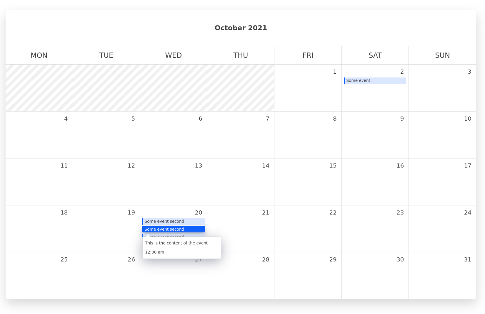

# Tithi - A statically generated calendar

Tithi creates a calendar with tasks/events/contents based completely on the date frontmatter in a content markdown. It doesn't need any other information. Just create a new content with a particular date and time, and Tithi will create a month view calendar for that particular month.

TODO:
In case the events range over multiple months, it provides a month selector which allows you to select months ranging from the first month that has an event to the last month that has an event

## Usage

- Install zola using the following guide: https://www.getzola.org/documentation/getting-started/installation/
- Download or clone this repository
- Replace the example markdown files in the `content` folder with appropriate markdown file that you want to show in your calendar. Ensure that the posts that you want to be shown in the calendar has `show_in_calendar = true`
- In `config.toml`, mention the `base_url` where you will host the calendar. This is used to build paths for static assets by zola
- Build the project: `zola build`
- You should now have a `public` folder. You can deploy this folder, wherever you want to host your server.

## Contributing guidelines

### Found a bug? Want a new feature?

If you want to report a bug, or want to suggest a new feature, please go to [issues](https://github.com/SaptakS/tithi/issues/new) and create an issue

### Found something wrong in this README?

Feel free to edit this file, and create a PR

### Want to help improve designs?

Please create a [new issue](https://github.com/SaptakS/tithi/issues/new) with design improvement suggestions

### Want to help fix a bug, or build a feature?

For this, you will need to develop the project locally. Following are the steps for how to do that:

- Install zola using the following guide: https://www.getzola.org/documentation/getting-started/installation/
- Clone this repository: `git clone git@github.com:SaptakS/tithi.git`
- Serve the project locally: `zola serve`
- Visit: `[http://127.0.0.1:1111/](http://127.0.0.1:1111/)`

### Different folders in the project

- **content** - This contains all the markdown files that represent the events/tasks for particular dates. You need to create markdowns with proper dates (YYYY-MM-DD or RFC3339 e.g. 2002-10-02T15:00:00Z). If date is mentioned in YYYY-MM-DD format, the time shown in the event details on clicking is always 12:00 am. The title of the content is shown on the event summary, and rest of the content (along with time) is shown on clicking. Ensure that the posts that you want to be shown in the calendar has `show_in_calendar = true`

- **sass** - Contains all the SASS stylesheets. The `grids` module contains the monthly calendar grid layout logic. Rest of the modules are specific to what the name suggests

- **static** - Contains the font and image files

- **templates** - Contains the HTML template files written using [Tera](https://tera.netlify.app/docs/). All the month and date logics are written using [chrono](https://docs.rs/chrono/0.4.19/chrono/format/strftime/index.html) which is used by Tera for date handling
